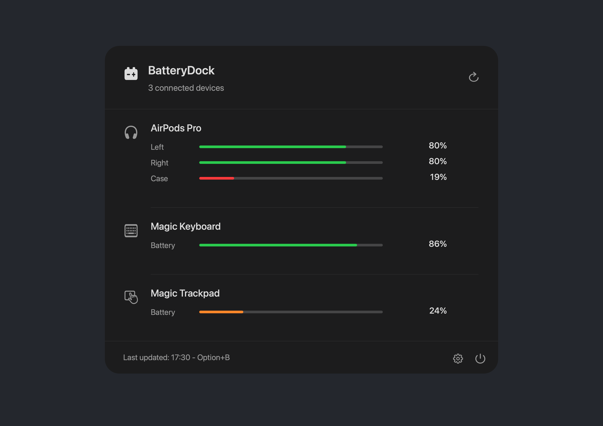
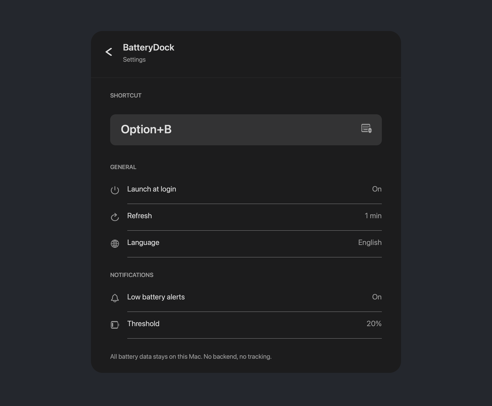

# BatteryDock

BatteryDock is a tiny macOS menu bar app for checking the battery percentages of connected Bluetooth devices without opening System Settings.

It is built for one job: click the menu bar icon, see the devices macOS exposes, and get back to work.

## Features

- Menu bar popover with connected Bluetooth device battery percentages
- Support for Apple input devices, AirPods-style split readings, and devices whose battery data is exposed by macOS
- Optional menu bar percentage display
- Global keyboard shortcut, default `Option+B`
- Low battery notifications
- Launch at login
- Refresh interval controls
- Multiple languages
- No account, no backend, no analytics, no tracking

## Install

Download the latest `.dmg` from the [Releases](https://github.com/TemelGunaydin/BatteryDock/releases) page, open it, then drag `BatteryDock.app` into `Applications`.

GitHub release builds are Developer ID-signed and notarized by Apple.

## Device Support

BatteryDock can only show battery data that macOS makes available locally. If macOS itself does not expose a percentage for a headset, speaker, or third-party Bluetooth device, BatteryDock cannot reliably invent it.

This is why some devices may appear by name but show no battery percentage. The app keeps those devices visible and clearly marks unavailable battery data.

## Privacy

BatteryDock runs entirely on your Mac.

- No servers
- No analytics SDKs
- No tracking
- No accounts
- No Bluetooth data leaves your device

## License

MIT
